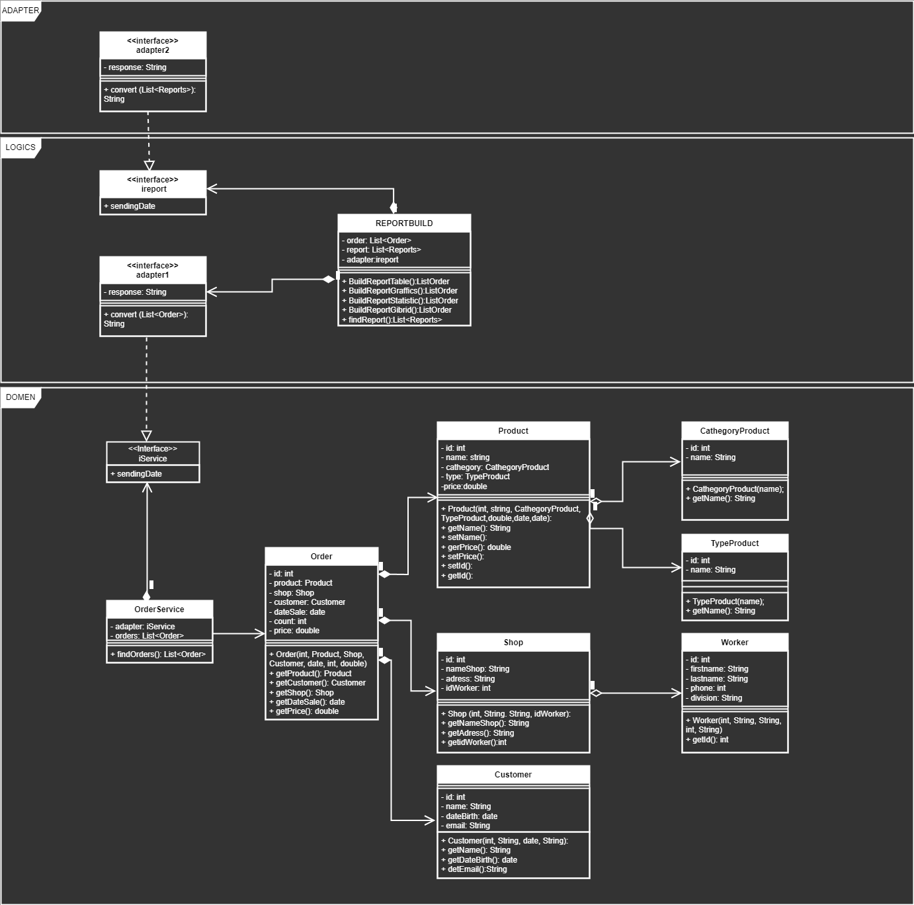

> **Семинар 7. Типа архитектур WEB-приложений: MPA, SPA.**

> Домашнее задание:
* Доработать экранные формы интерфейса
* Разработать полную ERD домена
* Разработать диаграмму компонент в UML включая слои пользовательского интерфейса и бизнес-логики.

> Выполнение:

* Экранные формы интерфейса не сильно отличаются от предложенных в семинарском занятии, однако мною принято решение добавить формы отчета, промежуток, за который отчет делается, окно идентефикации и кнопка "Отправить". Результат:

* В диаграмме ERD более подробно расписал взаимоотношения между поставщиком, магазином , складом, покупателем

* Приразработке UML диаграммы произошло переосмысление ERD диаграммы, однако, к сожалению, последняя не была сохранена в исходнике для переделки. Такие сущности как склад и поставщик реализовывать не стал ввиду громоздкости диаграммы.

